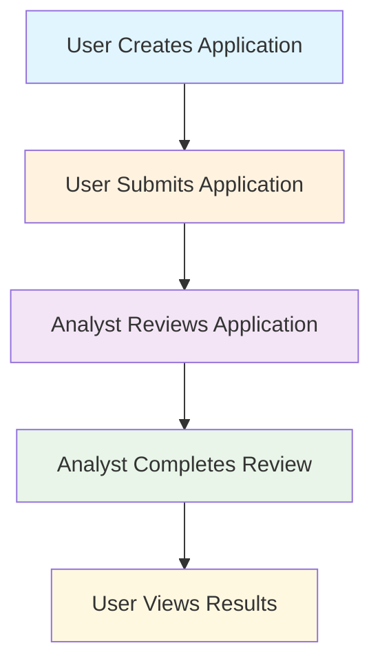
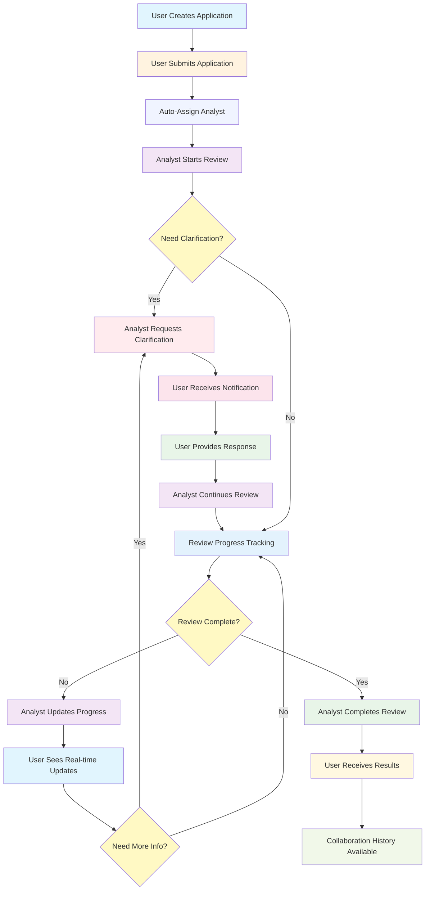
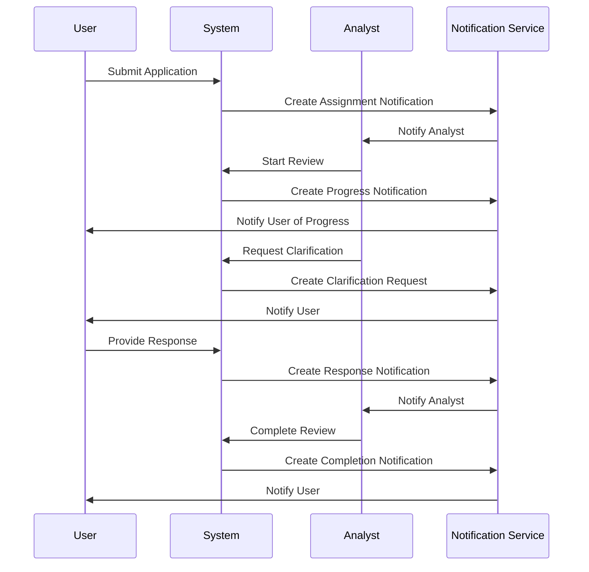
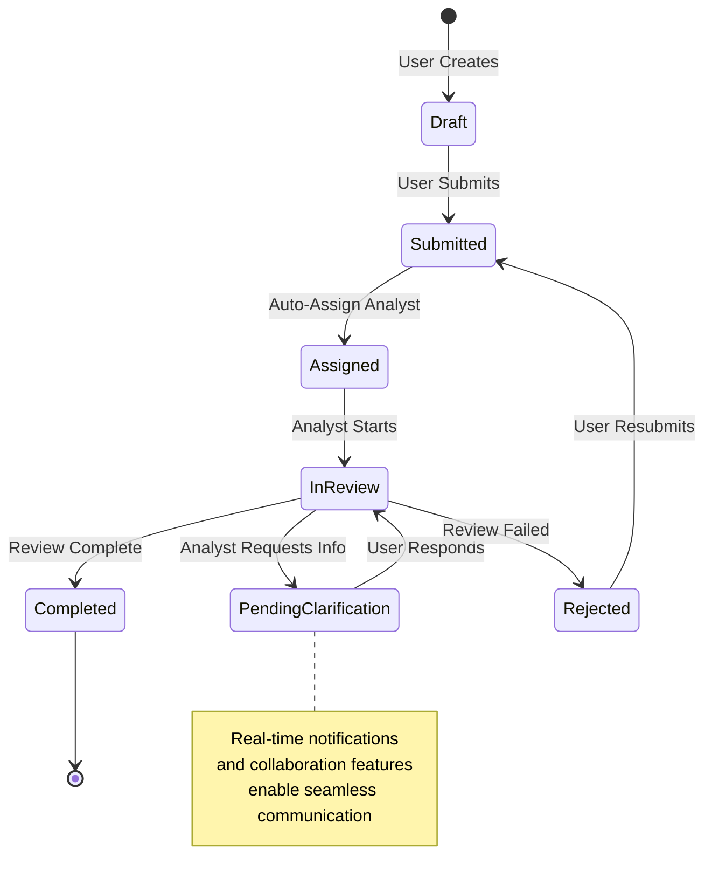

# Enhanced Workflow Diagram: User-Analyst Collaboration

## Current vs Enhanced Workflow Comparison

### Current Workflow (Basic)


### Enhanced Workflow (Collaborative)


## Detailed Collaboration Flow

### Real-time Communication System


### Enhanced Status Transitions


## Key Improvements Implemented

### 1. Real-time Communication
- **WebSocket Integration**: Live updates for status changes
- **Push Notifications**: Instant alerts for important events
- **In-app Messaging**: Direct communication between users and analysts
- **Email Notifications**: Backup notification system

### 2. Collaborative Features
- **Clarification Requests**: Analysts can ask for additional information
- **Progress Tracking**: Real-time visibility into review progress
- **Collaboration History**: Complete audit trail of all interactions
- **File Sharing**: Enhanced document collaboration

### 3. Smart Assignment
- **Auto-Assignment**: Automatic analyst assignment based on expertise
- **Workload Balancing**: Distribute reviews evenly across analysts
- **Priority Handling**: Critical applications get senior analysts
- **Escalation**: Automatic escalation for overdue reviews

### 4. Enhanced User Experience
- **Live Dashboards**: Real-time status updates and progress tracking
- **Mobile Responsive**: Access from any device
- **Notification Center**: Centralized notification management
- **Collaboration Timeline**: Visual history of all interactions

## Technical Architecture

### Database Schema Enhancements
```sql
-- Enhanced notifications with collaboration support
CREATE TABLE workflow_notifications (
    id TEXT PRIMARY KEY,
    application_id TEXT NOT NULL,
    from_user_id TEXT,
    to_user_id TEXT,
    notification_type TEXT NOT NULL,
    message TEXT NOT NULL,
    metadata TEXT, -- JSON data for rich notifications
    read_at TIMESTAMP,
    created_at TIMESTAMP DEFAULT CURRENT_TIMESTAMP
);

-- Collaboration comments and discussions
CREATE TABLE collaboration_comments (
    id TEXT PRIMARY KEY,
    application_id TEXT NOT NULL,
    question_id TEXT,
    user_id TEXT NOT NULL,
    comment TEXT NOT NULL,
    parent_comment_id TEXT,
    created_at TIMESTAMP DEFAULT CURRENT_TIMESTAMP
);

-- Progress tracking with milestones
CREATE TABLE review_progress (
    id TEXT PRIMARY KEY,
    application_id TEXT NOT NULL,
    review_id TEXT NOT NULL,
    milestone TEXT NOT NULL,
    progress_percentage INTEGER DEFAULT 0,
    notes TEXT,
    created_at TIMESTAMP DEFAULT CURRENT_TIMESTAMP
);
```

### API Endpoints
```python
# Real-time communication
POST /api/workflow/clarification-request
POST /api/workflow/respond-clarification
GET  /api/workflow/collaboration-history/<app_id>

# Smart assignment
POST /api/workflow/assign-analyst
GET  /api/workflow/available-analysts

# Notifications
GET  /api/workflow/notifications
POST /api/workflow/notifications/<id>/read
```

## Benefits of Enhanced Workflow

### For Users
- **Better Visibility**: Real-time progress tracking and status updates
- **Improved Communication**: Direct interaction with analysts
- **Faster Resolution**: Collaborative finding resolution
- **Enhanced Experience**: Modern, interactive interface

### For Analysts
- **Efficient Assignment**: Auto-assignment based on expertise
- **Better Collaboration**: Direct communication with users
- **Workload Management**: Balanced queue and priority handling
- **Quality Tools**: Enhanced review and analysis capabilities

### For Administrators
- **Process Oversight**: Complete visibility into all interactions
- **Performance Metrics**: Analytics on review efficiency and quality
- **Resource Management**: Optimal analyst utilization
- **Compliance**: Complete audit trail of all activities

## Success Metrics

### Key Performance Indicators
1. **Review Time**: Average time from submission to completion
2. **User Satisfaction**: Feedback scores and response times
3. **Analyst Efficiency**: Reviews completed per analyst per day
4. **Collaboration Quality**: Number of clarifications and resolution time
5. **System Adoption**: Usage of new collaboration features

### Monitoring Dashboard
- Real-time workflow status
- Performance metrics and trends
- User and analyst activity
- System health and SLA compliance

## Implementation Timeline

### Phase 1: Foundation (Weeks 1-2)
- Enhanced workflow engine
- Basic notification system
- API endpoints for collaboration

### Phase 2: Communication (Weeks 3-4)
- Real-time messaging
- Clarification workflow
- Progress tracking

### Phase 3: Intelligence (Weeks 5-6)
- Smart assignment algorithm
- Workload balancing
- Analytics dashboard

### Phase 4: Polish (Weeks 7-8)
- Mobile optimization
- Advanced features
- Performance tuning

This enhanced workflow significantly improves the collaboration between users and analysts, leading to faster, more efficient, and more transparent security review processes.
