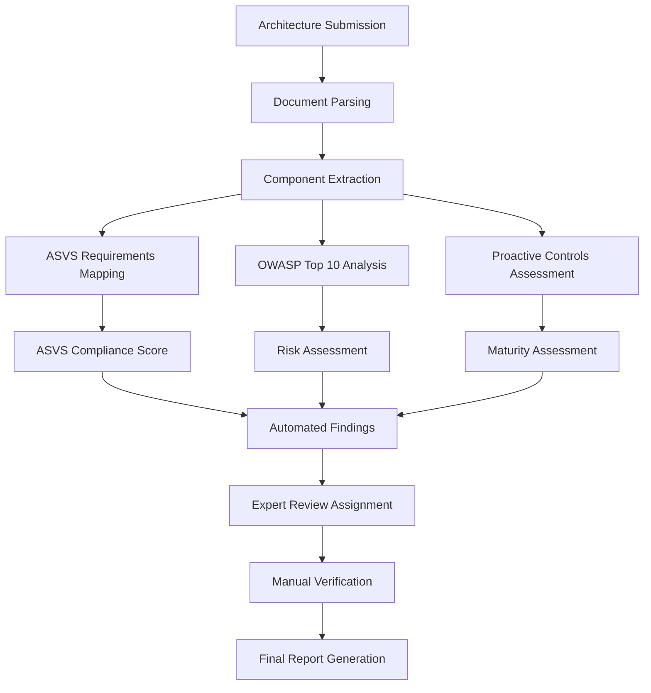

# OWASP Standards Integration Framework

## 1. Overview

The SecureArch Portal integrates three core OWASP standards to provide comprehensive security architecture reviews:

1. **OWASP ASVS (Application Security Verification Standard)** - Verification requirements framework
2. **OWASP Top 10** - Most critical application security risks
3. **OWASP Proactive Controls** - Secure development practices

## 2. OWASP ASVS Integration

### 2.1 ASVS Framework Implementation

#### 2.1.1 Verification Levels

```yaml
Level 1 (Opportunistic):
  Target: Basic security controls
  Use Case: All applications
  Requirements: 74 verification requirements
  Scope: Basic security hygiene
  
Level 2 (Standard):
  Target: Most applications handling sensitive data
  Use Case: Applications with moderate risk
  Requirements: 149 verification requirements
  Scope: Comprehensive security controls
  
Level 3 (Advanced):
  Target: Critical applications and high-value assets
  Use Case: High-risk applications
  Requirements: 178 verification requirements
  Scope: Advanced security controls and threat modeling
```

#### 2.1.2 ASVS Categories Mapping

```typescript
interface ASVSCategory {
  id: string;
  version: string;
  category: string;
  subcategory?: string;
  level: 1 | 2 | 3;
  requirement: string;
  verification: string;
  cweReferences: string[];
  implementationGuidance: string;
}

const asvsCategories = {
  "V1": "Architecture, Design and Threat Modeling",
  "V2": "Authentication",
  "V3": "Session Management", 
  "V4": "Access Control",
  "V5": "Validation, Sanitization and Encoding",
  "V6": "Stored Cryptography",
  "V7": "Error Handling and Logging",
  "V8": "Data Protection",
  "V9": "Communication",
  "V10": "Malicious Code",
  "V11": "Business Logic",
  "V12": "File and Resources",
  "V13": "API and Web Service",
  "V14": "Configuration"
};
```

#### 2.1.3 ASVS Compliance Scoring

```typescript
interface ASVSAssessment {
  reviewId: string;
  targetLevel: 1 | 2 | 3;
  overallScore: number;
  categoryScores: {
    [category: string]: {
      score: number;
      totalRequirements: number;
      compliantRequirements: number;
      findings: Finding[];
    };
  };
  recommendations: string[];
  nextSteps: string[];
}

// Scoring Algorithm
function calculateASVSScore(assessments: CategoryAssessment[]): number {
  const weightedScores = assessments.map(assessment => ({
    score: assessment.compliantRequirements / assessment.totalRequirements,
    weight: getCategory Weight(assessment.category)
  }));
  
  const totalWeight = weightedScores.reduce((sum, item) => sum + item.weight, 0);
  const weightedSum = weightedScores.reduce((sum, item) => sum + (item.score * item.weight), 0);
  
  return (weightedSum / totalWeight) * 100;
}
```

### 2.2 Automated ASVS Verification

#### 2.2.1 Architecture Analysis Rules

```yaml
V1_Architecture_Rules:
  V1.1.1:
    requirement: "Verify documented security requirements"
    automation_check: "Check for security requirements document"
    pattern_match: ["security requirements", "security specifications"]
    
  V1.1.2:
    requirement: "Verify application components are documented"
    automation_check: "Identify all components in architecture diagrams"
    pattern_match: ["component diagram", "system architecture"]
    
  V1.2.1:
    requirement: "Verify authentication architecture"
    automation_check: "Identify authentication mechanisms"
    pattern_match: ["authentication", "SSO", "login", "OAuth"]

V4_Access_Control_Rules:
  V4.1.1:
    requirement: "Verify principle of least privilege"
    automation_check: "Analyze role definitions and permissions"
    pattern_match: ["RBAC", "permissions", "roles", "access control"]
    
  V4.1.2:
    requirement: "Verify access controls fail securely"
    automation_check: "Check for default deny configurations"
    pattern_match: ["default deny", "whitelist", "fail secure"]
```

#### 2.2.2 Expert Review Integration

```typescript
interface ExpertReviewTask {
  asvsRequirement: string;
  category: string;
  level: number;
  automationResult: 'pass' | 'fail' | 'manual_review_required';
  expertAssignment: {
    expertId: string;
    specialization: string[];
    reviewDeadline: Date;
  };
  reviewCriteria: {
    evidenceRequired: string[];
    verificationSteps: string[];
    acceptanceCriteria: string[];
  };
}
```

## 3. OWASP Top 10 Integration

### 3.1 Current OWASP Top 10 (2021) Mapping

```typescript
const owaspTop10_2021 = {
  "A01": {
    category: "Broken Access Control",
    description: "Access control enforces policy such that users cannot act outside of their intended permissions",
    asvsMapping: ["V4.1.1", "V4.1.2", "V4.1.3", "V4.2.1", "V4.2.2"],
    architectureChecks: [
      "Role-based access control implementation",
      "Resource-level permissions",
      "API endpoint protection",
      "Administrative function separation"
    ],
    riskFactors: {
      prevalence: "widespread",
      detectability: "average", 
      impact: "severe"
    }
  },
  
  "A02": {
    category: "Cryptographic Failures",
    description: "Cryptographic failures lead to exposure of sensitive data",
    asvsMapping: ["V6.1.1", "V6.2.1", "V6.3.1", "V6.4.1"],
    architectureChecks: [
      "Data encryption at rest",
      "Data encryption in transit",
      "Key management practices",
      "Certificate management"
    ]
  },
  
  "A03": {
    category: "Injection",
    description: "Injection flaws occur when untrusted data is sent to an interpreter",
    asvsMapping: ["V5.1.1", "V5.1.2", "V5.2.1", "V5.3.1"],
    architectureChecks: [
      "Input validation mechanisms",
      "Parameterized queries",
      "Output encoding",
      "Template injection prevention"
    ]
  }
  // ... continue for all A01-A10
};
```

### 3.2 Risk Assessment Framework

```typescript
interface RiskAssessment {
  owaspCategory: string;
  riskScore: number; // 0-10 scale
  likelihood: 'low' | 'medium' | 'high';
  impact: 'low' | 'medium' | 'high' | 'critical';
  businessContext: {
    dataClassification: string;
    userBase: string;
    complianceRequirements: string[];
  };
  mitigationStatus: 'none' | 'partial' | 'complete';
  findings: Finding[];
}

// Risk Scoring Algorithm
function calculateOwaspRiskScore(
  category: string,
  architectureFeatures: string[],
  businessContext: BusinessContext
): RiskAssessment {
  const baseScore = getBaseRiskScore(category);
  const mitigationScore = calculateMitigationScore(architectureFeatures, category);
  const contextMultiplier = getBusinessContextMultiplier(businessContext);
  
  const finalScore = (baseScore - mitigationScore) * contextMultiplier;
  
  return {
    owaspCategory: category,
    riskScore: Math.max(0, Math.min(10, finalScore)),
    likelihood: determineLikelihood(finalScore),
    impact: determineImpact(finalScore, businessContext),
    // ... other properties
  };
}
```

### 3.3 Top 10 Architecture Analysis

```typescript
interface ArchitectureAnalysis {
  documentId: string;
  analysisTimestamp: Date;
  extractedComponents: Component[];
  securityPatterns: SecurityPattern[];
  owaspTop10Assessment: {
    [category: string]: {
      present: boolean;
      riskLevel: 'low' | 'medium' | 'high' | 'critical';
      findings: string[];
      recommendations: string[];
    };
  };
}

class OwaspTop10Analyzer {
  async analyzeArchitecture(documents: Document[]): Promise<ArchitectureAnalysis> {
    const components = await this.extractComponents(documents);
    const patterns = await this.identifySecurityPatterns(components);
    
    const assessment = {};
    for (const [key, category] of Object.entries(owaspTop10_2021)) {
      assessment[key] = await this.assessCategory(category, components, patterns);
    }
    
    return {
      documentId: documents[0].id,
      analysisTimestamp: new Date(),
      extractedComponents: components,
      securityPatterns: patterns,
      owaspTop10Assessment: assessment
    };
  }
  
  private async assessCategory(
    category: OwaspCategory,
    components: Component[],
    patterns: SecurityPattern[]
  ): Promise<CategoryAssessment> {
    // Implementation of category-specific analysis
    const relevantComponents = this.filterRelevantComponents(components, category);
    const mitigationPatterns = this.findMitigationPatterns(patterns, category);
    
    return {
      present: relevantComponents.length > 0,
      riskLevel: this.calculateRiskLevel(category, relevantComponents, mitigationPatterns),
      findings: this.generateFindings(category, relevantComponents),
      recommendations: this.generateRecommendations(category, mitigationPatterns)
    };
  }
}
```

## 4. OWASP Proactive Controls Integration

### 4.1 Proactive Controls Framework

```typescript
const owaspProactiveControls2024 = {
  "C1": {
    control: "Implement Access Control",
    description: "Implement proper authentication and authorization mechanisms",
    asvsMapping: ["V2", "V3", "V4"],
    owaspTop10Prevention: ["A01", "A07"],
    architectureChecks: [
      "Authentication mechanism defined",
      "Authorization model documented", 
      "Session management strategy",
      "Multi-factor authentication"
    ],
    implementationGuidance: {
      design: "Define clear authentication and authorization requirements",
      architecture: "Implement centralized access control",
      development: "Use established authentication frameworks"
    }
  },
  
  "C2": {
    control: "Use Cryptography to Protect Data",
    description: "Protect data using strong cryptographic controls",
    asvsMapping: ["V6", "V8", "V9"],
    owaspTop10Prevention: ["A02", "A04"],
    architectureChecks: [
      "Data classification scheme",
      "Encryption at rest strategy",
      "Encryption in transit",
      "Key management architecture"
    ]
  },
  
  "C3": {
    control: "Validate all Input & Handle Exceptions",
    description: "Implement comprehensive input validation",
    asvsMapping: ["V5", "V7"],
    owaspTop10Prevention: ["A03", "A09"],
    architectureChecks: [
      "Input validation strategy",
      "Output encoding mechanisms",
      "Error handling approach",
      "Logging architecture"
    ]
  }
  // ... continue for all C1-C10
};
```

### 4.2 Proactive Controls Assessment

```typescript
interface ProactiveControlsAssessment {
  reviewId: string;
  overallMaturity: 'basic' | 'developing' | 'defined' | 'managed' | 'optimizing';
  controlAssessments: {
    [controlId: string]: {
      implemented: boolean;
      maturityLevel: number; // 1-5 scale
      evidenceFound: string[];
      gaps: string[];
      recommendations: string[];
    };
  };
  roadmap: ImplementationRoadmap;
}

class ProactiveControlsAnalyzer {
  async assessControls(
    architecture: ArchitectureDocuments,
    requirements: SecurityRequirements
  ): Promise<ProactiveControlsAssessment> {
    const assessments = {};
    
    for (const [id, control] of Object.entries(owaspProactiveControls2024)) {
      assessments[id] = await this.assessControl(control, architecture, requirements);
    }
    
    return {
      reviewId: architecture.reviewId,
      overallMaturity: this.calculateOverallMaturity(assessments),
      controlAssessments: assessments,
      roadmap: this.generateRoadmap(assessments)
    };
  }
  
  private async assessControl(
    control: ProactiveControl,
    architecture: ArchitectureDocuments,
    requirements: SecurityRequirements
  ): Promise<ControlAssessment> {
    const evidenceFound = [];
    const gaps = [];
    
    // Check architecture documents for control implementation evidence
    for (const check of control.architectureChecks) {
      const evidence = await this.findEvidence(check, architecture);
      if (evidence.length > 0) {
        evidenceFound.push(...evidence);
      } else {
        gaps.push(check);
      }
    }
    
    const maturityLevel = this.calculateMaturityLevel(evidenceFound, gaps, control);
    const recommendations = this.generateRecommendations(gaps, control);
    
    return {
      implemented: evidenceFound.length > gaps.length,
      maturityLevel,
      evidenceFound,
      gaps,
      recommendations
    };
  }
}
```

## 5. Integration Workflow

### 5.1 Analysis Pipeline



### 5.2 Scoring Integration

```typescript
interface ComprehensiveSecurityScore {
  overallScore: number; // 0-100
  asvsCompliance: {
    level1: number;
    level2: number;
    level3: number;
    targetLevel: number;
    currentAchievement: number;
  };
  owaspTop10Risk: {
    overallRisk: 'low' | 'medium' | 'high' | 'critical';
    categoryRisks: { [category: string]: number };
    highRiskCount: number;
    mediumRiskCount: number;
  };
  proactiveControls: {
    implementationMaturity: number; // 1-5
    implementedControls: number;
    totalControls: number;
    maturityByControl: { [controlId: string]: number };
  };
  recommendations: {
    immediate: Recommendation[];
    shortTerm: Recommendation[];
    longTerm: Recommendation[];
  };
}

function calculateComprehensiveScore(
  asvsAssessment: ASVSAssessment,
  riskAssessment: RiskAssessment[],
  controlsAssessment: ProactiveControlsAssessment
): ComprehensiveSecurityScore {
  // Weighted scoring algorithm
  const asvsWeight = 0.4;
  const riskWeight = 0.4;
  const controlsWeight = 0.2;
  
  const asvsScore = asvsAssessment.overallScore;
  const riskScore = calculateInverseRiskScore(riskAssessment);
  const controlsScore = (controlsAssessment.overallMaturity / 5) * 100;
  
  const overallScore = (
    asvsScore * asvsWeight +
    riskScore * riskWeight +
    controlsScore * controlsWeight
  );
  
  return {
    overallScore: Math.round(overallScore),
    asvsCompliance: {
      level1: calculateLevelScore(asvsAssessment, 1),
      level2: calculateLevelScore(asvsAssessment, 2),
      level3: calculateLevelScore(asvsAssessment, 3),
      targetLevel: asvsAssessment.targetLevel,
      currentAchievement: asvsScore
    },
    // ... other properties
  };
}
```

## 6. Expert Knowledge Base

### 6.1 OWASP Standards Database

```sql
-- OWASP ASVS Requirements
CREATE TABLE asvs_requirements (
    id VARCHAR(20) PRIMARY KEY,
    version VARCHAR(10) NOT NULL,
    level INTEGER NOT NULL,
    category VARCHAR(10) NOT NULL,
    subcategory VARCHAR(100),
    requirement TEXT NOT NULL,
    verification_guidance TEXT,
    cwe_references TEXT[],
    implementation_guidance TEXT,
    updated_at TIMESTAMP WITH TIME ZONE DEFAULT NOW()
);

-- OWASP Top 10 Categories
CREATE TABLE owasp_top10 (
    id VARCHAR(10) PRIMARY KEY,
    year INTEGER NOT NULL,
    rank INTEGER NOT NULL,
    category VARCHAR(100) NOT NULL,
    description TEXT NOT NULL,
    prevalence VARCHAR(20),
    detectability VARCHAR(20),
    impact VARCHAR(20),
    cwe_mapping TEXT[],
    prevention_guidance TEXT,
    updated_at TIMESTAMP WITH TIME ZONE DEFAULT NOW()
);

-- Proactive Controls
CREATE TABLE proactive_controls (
    id VARCHAR(10) PRIMARY KEY,
    version VARCHAR(10) NOT NULL,
    control_number INTEGER NOT NULL,
    title VARCHAR(200) NOT NULL,
    description TEXT NOT NULL,
    implementation_guidance TEXT,
    owasp_top10_prevention TEXT[],
    asvs_mapping TEXT[],
    updated_at TIMESTAMP WITH TIME ZONE DEFAULT NOW()
);

-- Expert Knowledge Rules
CREATE TABLE analysis_rules (
    id UUID PRIMARY KEY DEFAULT gen_random_uuid(),
    rule_type VARCHAR(50) NOT NULL, -- 'asvs', 'top10', 'controls'
    owasp_reference VARCHAR(20) NOT NULL,
    pattern_type VARCHAR(50) NOT NULL, -- 'text', 'diagram', 'component'
    search_patterns TEXT[] NOT NULL,
    weight DECIMAL(3,2) DEFAULT 1.0,
    confidence_threshold DECIMAL(3,2) DEFAULT 0.7,
    is_active BOOLEAN DEFAULT TRUE,
    created_at TIMESTAMP WITH TIME ZONE DEFAULT NOW()
);
```

### 6.2 Continuous Updates Framework

```typescript
interface OwaspUpdatesMonitor {
  checkForUpdates(): Promise<void>;
  updateASVSRequirements(version: string): Promise<void>;
  updateTop10Categories(year: number): Promise<void>;
  updateProactiveControls(version: string): Promise<void>;
  notifyExpertsOfChanges(changes: Change[]): Promise<void>;
}

class OwaspStandardsUpdater implements OwaspUpdatesMonitor {
  private readonly updateSchedule = {
    asvs: '0 0 1 * *', // Monthly check
    top10: '0 0 1 1 *', // Yearly check
    controls: '0 0 1 */3 *' // Quarterly check
  };
  
  async checkForUpdates(): Promise<void> {
    const latestVersions = await this.fetchLatestVersions();
    const currentVersions = await this.getCurrentVersions();
    
    const updates = this.compareVersions(latestVersions, currentVersions);
    
    if (updates.length > 0) {
      await this.processUpdates(updates);
      await this.notifyStakeholders(updates);
    }
  }
}
```

This comprehensive OWASP integration framework ensures that the SecureArch Portal stays current with evolving security standards while providing accurate, actionable security assessments based on industry best practices. 