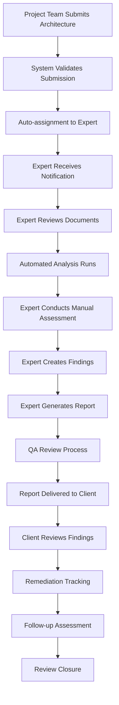
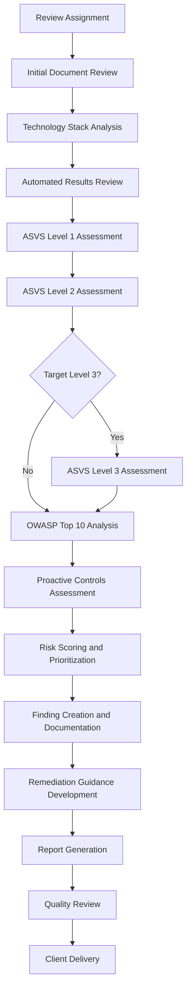
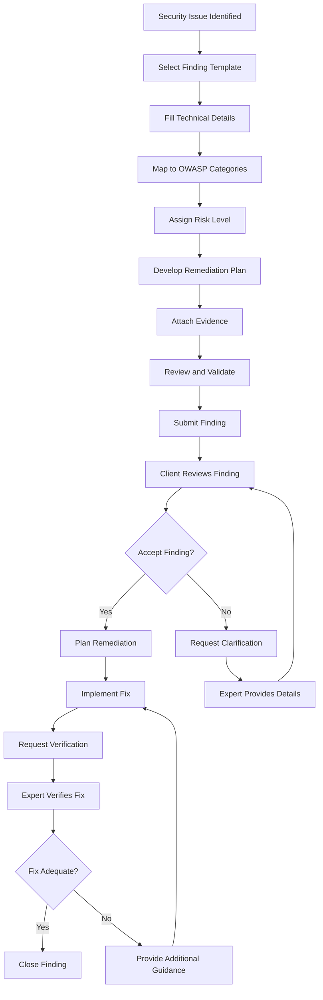

# User Stories and Workflow Specifications

## 1. User Personas

### 1.1 Primary Personas

#### Security Architect (Emma)
- **Role**: Senior Security Architect at a Fortune 500 company
- **Experience**: 8+ years in application security
- **Goals**: Ensure applications meet security standards, reduce review time
- **Pain Points**: Manual reviews are time-consuming, inconsistent assessments
- **Technical Level**: High - understands OWASP standards deeply

#### Development Team Lead (Marcus)
- **Role**: Lead Developer at a mid-size tech company
- **Experience**: 6 years development, limited security background
- **Goals**: Get security approval quickly, understand requirements clearly
- **Pain Points**: Security requirements unclear, delayed project timelines
- **Technical Level**: Medium - understands architecture, learning security

#### Security Expert/Consultant (Dr. Sarah Chen)
- **Role**: Independent security consultant
- **Experience**: 12+ years, CISSP certified
- **Goals**: Efficiently review multiple client architectures, maintain quality
- **Pain Points**: Managing multiple clients, tracking findings across projects
- **Technical Level**: Expert - deep knowledge of multiple frameworks

#### Compliance Manager (Robert)
- **Role**: IT Compliance Manager at financial services firm
- **Experience**: 5 years in compliance, 10 years IT
- **Goals**: Demonstrate compliance to auditors, track improvements
- **Pain Points**: Manual reporting, difficult to show trends
- **Technical Level**: Medium - understands frameworks, not deeply technical

### 1.2 Secondary Personas

#### CISO (Jennifer)
- **Role**: Chief Information Security Officer
- **Goals**: Executive visibility into security posture
- **Needs**: High-level dashboards, trend analysis, risk metrics

#### Junior Security Analyst (Alex)
- **Role**: Recently hired security analyst
- **Goals**: Learn security assessment techniques
- **Needs**: Guided workflows, educational content, mentorship

## 2. Core User Stories

### 2.1 Architecture Submission Workflow

#### Story AS-001: Submit Architecture for Review
```gherkin
As a Development Team Lead
I want to submit my application architecture for security review
So that I can ensure it meets security standards before development

Acceptance Criteria:
- I can create a new review request with project details
- I can upload multiple architecture documents (PDF, Visio, images)
- I can specify technology stack and compliance requirements
- I can set target ASVS level and business criticality
- I receive confirmation and tracking number upon submission
- System automatically assigns appropriate expert based on specialization

Workflow:
1. Navigate to "New Submission" page
2. Fill in project information form
3. Upload architecture documents
4. Specify technology stack and requirements
5. Set priority and timeline
6. Submit for review
7. Receive confirmation email with tracking details

Technical Requirements:
- Multi-file upload with drag & drop
- Progress indicators for large files
- File validation (type, size, format)
- Auto-save draft functionality
- Email notifications
```

#### Story AS-002: Track Review Progress
```gherkin
As a Development Team Lead
I want to track the progress of my architecture review
So that I can plan my development timeline accordingly

Acceptance Criteria:
- I can view real-time status updates
- I can see estimated completion date
- I can receive notifications at key milestones
- I can communicate with assigned expert
- I can view preliminary findings as they're identified

Workflow:
1. Access review dashboard
2. View progress timeline with current status
3. See assigned expert information
4. Review preliminary findings
5. Participate in clarification discussions
6. Receive completion notification

Technical Requirements:
- Real-time status updates via WebSocket
- Progress visualization
- In-app messaging system
- Email and Slack notifications
- Mobile-responsive interface
```

### 2.2 Expert Review Workflow

#### Story ER-001: Review Assignment and Management
```gherkin
As a Security Expert
I want to efficiently manage my assigned reviews
So that I can provide high-quality assessments within SLA

Acceptance Criteria:
- I can view all assigned reviews in priority order
- I can see review details and uploaded documents
- I can access automated analysis results
- I can track time spent on each review
- I can manage my workload and availability

Workflow:
1. Login to expert dashboard
2. View assigned reviews queue
3. Select high-priority review
4. Review project details and documents
5. Examine automated analysis results
6. Begin detailed manual assessment
7. Track time and update progress

Technical Requirements:
- Expert dashboard with workload visualization
- Document viewer with annotation tools
- Integration with automated analysis engine
- Time tracking functionality
- Workload balancing algorithms
```

#### Story ER-002: Conduct OWASP Assessment
```gherkin
As a Security Expert
I want to systematically assess architecture against OWASP standards
So that I provide consistent and comprehensive evaluations

Acceptance Criteria:
- I can use guided ASVS checklist for target level
- I can map findings to OWASP Top 10 categories
- I can assess against Proactive Controls
- I can override automated assessments with justification
- I can generate risk scores based on business context

Workflow:
1. Review automated OWASP analysis
2. Use ASVS checklist for manual verification
3. Identify security patterns and anti-patterns
4. Map findings to OWASP Top 10 risks
5. Assess implementation of Proactive Controls
6. Calculate risk scores considering business context
7. Document assessment rationale

Technical Requirements:
- Interactive ASVS checklist interface
- OWASP Top 10 mapping tools
- Risk scoring calculator
- Evidence attachment system
- Assessment templates and guidance
```

#### Story ER-003: Create and Manage Security Findings
```gherkin
As a Security Expert
I want to efficiently create and manage security findings
So that I can provide actionable remediation guidance

Acceptance Criteria:
- I can create findings from templates or scratch
- I can categorize findings by risk level and OWASP mapping
- I can provide detailed remediation guidance
- I can attach evidence and proof of concepts
- I can track finding resolution status

Workflow:
1. Identify security issue in architecture
2. Select appropriate finding template
3. Fill in technical details and impact
4. Map to OWASP categories and ASVS requirements
5. Provide remediation guidance and timeline
6. Attach supporting evidence
7. Assign severity and priority
8. Save and continue assessment

Technical Requirements:
- Finding templates library
- Rich text editor with code formatting
- OWASP mapping interface
- File attachment system
- Risk scoring automation
- Status tracking workflow
```

### 2.3 Dashboard and Analytics

#### Story DA-001: Security Posture Dashboard
```gherkin
As a CISO
I want to view organization-wide security posture
So that I can make informed decisions about security investments

Acceptance Criteria:
- I can see overall security score trends
- I can view risk distribution across projects
- I can identify common vulnerability patterns
- I can track expert performance and capacity
- I can generate executive reports

Workflow:
1. Access executive dashboard
2. Review key security metrics
3. Analyze trend data
4. Identify areas needing attention
5. Drill down into specific projects
6. Generate reports for board presentation

Technical Requirements:
- Interactive dashboards with drill-down
- Trend analysis and forecasting
- Executive-level reporting
- Data export capabilities
- Role-based access controls
```

#### Story DA-002: Compliance Reporting
```gherkin
As a Compliance Manager
I want to generate compliance reports automatically
So that I can demonstrate adherence to security standards

Acceptance Criteria:
- I can generate ASVS compliance reports
- I can track compliance trends over time
- I can export reports in multiple formats
- I can schedule automated report generation
- I can customize reports for different audiences

Workflow:
1. Navigate to compliance reporting section
2. Select report type and time period
3. Choose compliance framework (ASVS, ISO 27001, etc.)
4. Customize report parameters
5. Generate and review report
6. Export or schedule for automatic delivery

Technical Requirements:
- Report generation engine
- Multiple export formats (PDF, Excel, Word)
- Scheduling system
- Template customization
- Audit trail for generated reports
```

### 2.4 Integration and Automation

#### Story IA-001: CI/CD Pipeline Integration
```gherkin
As a DevOps Engineer
I want to integrate security reviews into our CI/CD pipeline
So that security assessments happen automatically

Acceptance Criteria:
- I can trigger reviews via API calls
- I can get security gates based on assessment results
- I can receive notifications of security issues
- I can track security debt over time
- I can automate remediation tracking

Workflow:
1. Configure webhook endpoints in CI/CD tool
2. Set security gate policies
3. Trigger automatic review on architecture changes
4. Receive security assessment results
5. Block deployments if critical issues found
6. Track remediation progress

Technical Requirements:
- RESTful API for CI/CD integration
- Webhook support for real-time notifications
- Security gate configuration
- Policy-based blocking mechanisms
- Integration documentation and SDKs
```

#### Story IA-002: Third-party Tool Integration
```gherkin
As a Security Architect
I want to integrate with existing security tools
So that I can consolidate security data and workflows

Acceptance Criteria:
- I can sync findings with Jira tickets
- I can export data to SIEM systems
- I can integrate with vulnerability scanners
- I can connect with GRC platforms
- I can maintain data consistency across tools

Workflow:
1. Configure integration settings
2. Map data fields between systems
3. Set up automated synchronization
4. Monitor integration health
5. Handle data conflicts and errors

Technical Requirements:
- Integration framework with popular tools
- Data mapping and transformation engine
- Error handling and retry mechanisms
- Integration monitoring and alerting
- API documentation for custom integrations
```

## 3. Detailed User Workflows

### 3.1 Complete Review Lifecycle



### 3.2 Expert Review Process Detail



### 3.3 Finding Management Workflow



## 4. User Interface Specifications

### 4.1 Dashboard Requirements

#### 4.1.1 Executive Dashboard
```yaml
Layout: Grid-based responsive design
Widgets:
  - Security Score Gauge (0-100)
  - Risk Distribution Chart (pie/donut)
  - Review Volume Trends (line chart)
  - OWASP Top 10 Heat Map
  - Expert Workload Status
  - Recent Activity Feed
  - Compliance Status Overview
  - Quick Actions Panel

Filters:
  - Time period selector
  - Organization filter (for MSPs)
  - Project type filter
  - Risk level filter

Export Options:
  - PDF executive summary
  - PowerPoint slides
  - Excel data export
  - Email scheduled reports
```

#### 4.1.2 Expert Dashboard
```yaml
Layout: Split-pane design
Left Panel:
  - Review queue (sortable/filterable)
  - My assignments
  - Workload calendar
  - Performance metrics

Main Panel:
  - Current review details
  - Document viewer
  - OWASP assessment tools
  - Finding creation interface
  - Progress tracking

Right Panel:
  - ASVS checklist
  - OWASP reference materials
  - Finding templates
  - Communication log
```

### 4.2 Interaction Patterns

#### 4.2.1 Progressive Disclosure
- Start with high-level overview
- Allow drilling down into details
- Maintain context and navigation
- Provide breadcrumb navigation

#### 4.2.2 Task-Oriented Design
- Guide users through complex workflows
- Provide step-by-step wizards
- Save progress automatically
- Allow resuming interrupted tasks

#### 4.2.3 Collaborative Features
- Real-time comments and discussions
- @mention notifications
- Activity streams
- Version control for documents

## 5. Performance and Usability Requirements

### 5.1 Performance Standards
- Page load time: < 2 seconds
- File upload: < 30 seconds for 50MB
- Report generation: < 5 minutes for standard reports
- Real-time updates: < 1 second latency
- Search results: < 500ms response time

### 5.2 Accessibility Standards
- WCAG 2.1 AA compliance
- Keyboard navigation support
- Screen reader compatibility
- High contrast mode
- Responsive design for mobile devices

### 5.3 Usability Metrics
- Task completion rate: > 95%
- User error rate: < 5%
- User satisfaction score: > 4.0/5.0
- Time to complete standard review: < 2 hours
- Expert onboarding time: < 1 day

This comprehensive user story specification ensures that the SecureArch Portal meets the needs of all user types while providing efficient, intuitive workflows for complex security assessment tasks. 